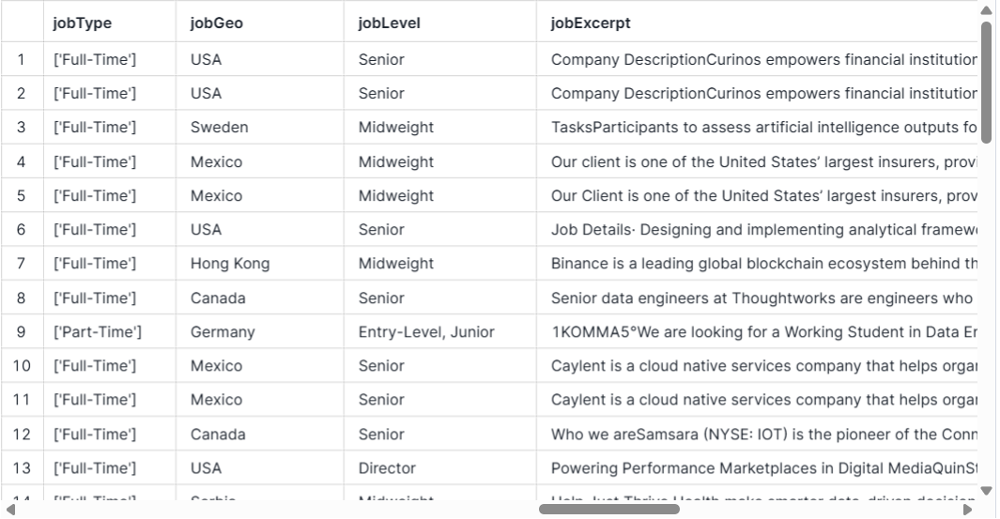

# **Pipeline de ELT para criação de listagem de trabalhos remotos**

### Resumo

Este projeto implementou um pipeline de ELT (Extract, Load, Transform) para coletar, armazenar e realizar transformações em dados sobre trabalho remoto em um banco de dados Snowflake. Um script Python foi usado para:

- Obter os dados por meio da API da Jobicy; e

- Carregar os dados no banco.

O dbt-core foi usado para:

- Realizar transformações nos dados. 

### Índice

- [1. Ferramentas utilizadas](https://github.com/luisamuzzi/projeto_elt_dbt?tab=readme-ov-file#1-ferramentas-utilizadas)
- [2. Estrutura do código](https://github.com/luisamuzzi/projeto_elt_dbt?tab=readme-ov-file#2-estrutura-do-c%C3%B3digo)
- [3. Estrutura das tabelas](https://github.com/luisamuzzi/projeto_elt_dbt?tab=readme-ov-file#3-estrutura-das-tabelas)
- [4. Estratégia de solução](https://github.com/luisamuzzi/projeto_elt_dbt?tab=readme-ov-file#4-estrat%C3%A9gia-de-solu%C3%A7%C3%A3o)
- [5. O produto final do projeto](https://github.com/luisamuzzi/projeto_elt_dbt?tab=readme-ov-file#5-o-produto-final-do-projeto)
- [6. Conclusão](https://github.com/luisamuzzi/projeto_elt_dbt?tab=readme-ov-file#6-conclus%C3%A3o)

### 1. Ferramentas utilizadas

**Linguagens:**

- Python: linguagem de programação principal.

- SQL: usada para transformações de dados.

**Bibliotecas Python:**

- `requests`: usada para fazer requisições HTTP.

- `pandas`: usada para armazenar os dados extraídos via API em um dataframe.

- `os`: usada para obter os valores das variáveis de ambiente.

- `dotenv`: usada para gerenciar as variáveis de ambiente.

- `sqlalchemy`: usada para criar uma engine de conexão com o banco de dados.

- `snowflake.sqlalchemy`: junto com a `sqlalchemy`, forneceu as ferramentas necessárias para realizar a conexão com o Snowflake.

**Banco de dados:**

- Snowflake: usado para armazenar os dados na cloud.

**Transformação de dados:**

- dbt (Data build tool): usado para realizar tratamentos/transformações nos dados usando SQL. 

**API:**

- [Jobicy API](https://jobicy.com/jobs-rss-feed): usada para obter os dados de trabalhos remotos.

### 2. Estrutura do código

**Classes:**

O [script python](extraction/script_v3.py) contém as classes:

- `JobicyAPI`: requisita os dados da API e salva em um dataframe.

- `Snowflake`: conecta e salva dados no banco de dados Snowflake.

**Transformação de dados com dbt:**

O dbt realiza o processamento dos dados armazenados no Snowflake, fazendo renomeação de colunas, conversão de tipos de dados e criação de colunas por meio de cálculos adicionais, conforme descrito no [script SQL](dbt/models/silver/trabalho_remoto.sql). 

**Execução:**

Ao ser executado, o script python coleta os dados da API, os transforma em um DataFrame e os armazena no Snowflake na tabela `remote_jobs`. Ao longo do processo o script exibe logs informando sobre o status, como mensagens de sucesso e erro.

Por meio do dbt, o script SQL gera uma tabela processada com as transformações realizadas e salva no dbt como a view `trabalho_remoto`. 

### 3. Estrutura das tabelas

**Tabela `remote_jobs` com dados brutos:**

A tabela que armazena os dados brutos coletados da API tem a seguinte estrutura:

|**Coluna**    |**Tipo**   |**Descrição**                    |
|--------------|-----------|---------------------------------|
|ID            |INT        |Identificador único da vaga      |
|URL           |STRING     |URL da vaga                      |
|jobSlug       |STRING     |Slug da vaga                     |
|jobTitle      |STRING     |Título da vaga                   |
|companyName   |STRING     |Nome da empresa                  |
|companyLogo   |STRING     |URL do logo da empresa           |
|jobIndustry   |STRING     |Indústria da vaga                |
|jobType       |STRING     |Tipo de trabalho                 |
|jobGeo        |STRING     |Localização                      |
|jobLevel      |STRING     |Nível de senioridade             |
|jobExcerpt    |STRING     |Resumo da vaga                   |
|jobDescription|STRING     |Descrição da vaga                |
|pubDate       |STRING     |Data de publicação               |
|salaryMin     |STRING     |Salário mínimo                   |
|salaryMax     |STRING     |Salário máximo                   |
|salaryCurrency|STRING     |Moeda do salário                 |
|salaryPeriod  |STRING     |Período em que o salário é pago  |

**Tabela `trabalho_remoto` com dados tratados:**

A tabela que armazena os dados tratados tem a seguinte estrutura:

|**Coluna**        |**Tipo**   |**Descrição**                    |
|------------------|-----------|---------------------------------|
|titulo_vaga       |STRING     |Título da vaga                   |
|nome_empresa      |STRING     |Nome da empresa                  |
|tipo_trabalho     |STRING     |Tipo de trabalho                 |
|localização       |STRING     |Localização                      |
|senioridade       |STRING     |Nível de senioridade             |
|min_salario_mensal|FLOAT      |Salário mínimo mensal            |
|min_salario_anual |FLOAT      |Salário mínimo anual             |
|max_salario_mensal|FLOAT      |Salário máximo mensal            |
|max_salario_anual |FLOAT      |Salário máximo anual             |
|moeda             |STRING     |Moeda do salário                 |

### 4. Estratégia de solução

1. Inicialização do ambiente virtual com pyenv e poetry:

O `pyenv` foi usado para gestão da versão do Python usada no projeto e o `poetry` para a gestão das bibliotecas.

2. Criação da database no Snowflake:

A database foi criada no Snowflake para receber os dados brutos e tratados, simulando o uso de um ambiente em nuvem.

3. Criação do script Python:

O script Python foi criado para realização do processo de extração dos dados da API da Jobicy e carga dos dados brutos no Snowflake, conforme descrito nas seções anteriores.

4. Tratamento dos dados com dbt:

O tratamento de dados foi realizado com dbt, gerando uma view no banco de dados.

### 5. O produto final do projeto

1. [Script Python](extraction/script_v3.py) que realiza as etapas de Extraction e Load do pipeline de ELT.

2. [Script SQL](dbt/models/silver/trabalho_remoto.sql) que realiza a etapa de Transformation do pipeline de ELT.

3. Tabela com dados brutos:

3. Tabela com dados transformados:

### 6. Conclusão

Este projeto criou um pipeline de ELT para coleta, carga e transformação de dados de trabalho remoto em um banco de dados Snowflake por meio de scripts Python e SQL. Para tanto, foram utilizadas as bibliotecas `requests`, `pandas`, `os`, `dotenv`, `sqlalchemy` e `snowflake.sqlalchemy` e o dbt. A API da Jobicy foi usada para extração dos dados e o banco de dados foi hospedado na plataforma de nuvem Snowflake.